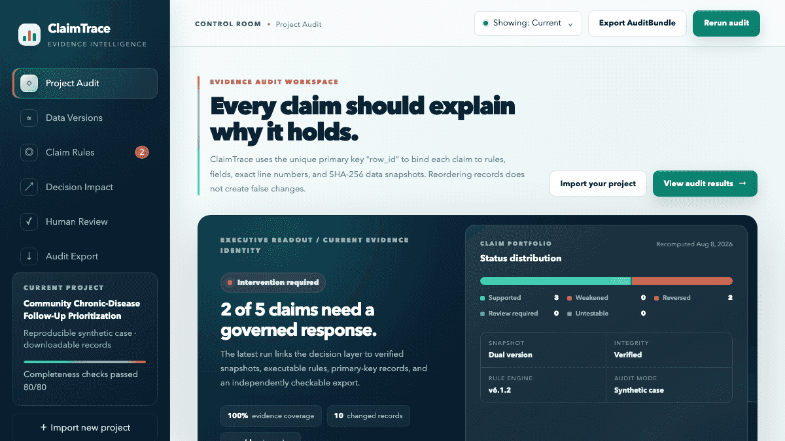

# ClaimTrace

> Versioned evidence and decision auditing for analytical claims.

[Case catalog](public/cases/catalog.json) · [15-program alignment](docs/PROGRAM_ALIGNMENT.md) · [Controlled benchmark](benchmarks/results.json) · [Implementation status](#implementation-status) · [Release checklist](docs/CLAIMTRACE_RELEASING.md)



ClaimTrace turns a report sentence into a governed, executable object. It connects natural-language claims to a user-selected primary key, exact CSV lines, raw and normalized SHA-256 snapshots, sample denominators, threshold provenance, deterministic rules, downstream decisions, and local review records.

When a revised dataset arrives, ClaimTrace aligns records by key and answers two separate questions:

1. Is the analytical claim still supported?
2. Did the action change, or does unchanged action merely require a new sign-off?

The repository includes a separately compiled read-only portfolio mode. The standard local build keeps import, rule creation, review, and export workflows available without an account or server-side data upload. No hosted deployment is required to review or run the project.

## Why it is different

Most data-diff tools stop at changed cells, while dashboards stop at changed metrics. ClaimTrace propagates a version change through a governed chain:

```text
source → snapshot → keyed records → sample profile → claim → decision → review → AuditBundle
```

Core safeguards:

- **Primary-key comparison:** record order does not create false changes.
- **Exact evidence references:** both versions retain keys, physical lines, fields, and snapshot hashes.
- **Balanced bounded export:** changed keys are paired across versions; real boundary rows come next; a fixed-seed sample fills remaining capacity.
- **Zero-baseline safety:** `0 → n` never becomes an invented percentage. It requires a governed absolute tolerance or review.
- **Tie- and missingness-aware rules:** ties, absent groups, empty groups, denominator changes, and cohort changes cannot silently pass.
- **Governed thresholds:** values, units, sources, rationales, confirmers, and confirmation times are rule content. Unconfirmed defaults remain preliminary.
- **Stable result identity:** a threshold, formula, filter, provenance, computed result, or evidence change creates a new claim-result ID and invalidates stale release state.
- **Separate claim and decision states:** claim statuses and decision statuses cannot be confused.
- **Action identity:** outcome, active action ID/instruction, recommended option, or feasible set changes produce `DECISION_CHANGED`; evidence-only identity changes produce `RESIGN_REQUIRED`.
- **Provenance gate:** numerical decision options without source, version, rationale, and units remain visible trial calculations but cannot be signed.
- **Decision depth:** constraint filtering, deterministic scoring, break-even benefit, score intervals, Pareto frontier, recommendation-stability sweeps, and fixed-seed bounded Monte Carlo are reported without calling them prediction probabilities.
- **Governance propagation:** a downstream decision cannot be released while any bound claim is blocked or unsigned.
- **Whole-bundle verification:** verification reconstructs snapshots and reruns claims, decisions, source transformations, review state, and summaries instead of trusting exported result fields.
- **Cross-bundle chain:** `previousBundleHash` links independently retained bundles; chain verification checks every root and exact predecessor relationship.

## Quick start

Requires Node.js 22.13 or newer.

```bash
npm ci
npm run dev
```

Open the local URL printed by Vite. CSV input supports UTF-8, UTF-8 with BOM, UTF-16LE with BOM, and UTF-16BE with BOM.

Full verification:

```bash
npx playwright install chromium
npm run ci
npm audit --omit=dev
npm audit
```

`npm run ci` runs lint, TypeScript checking, deterministic fixture generation, the benchmark, a production build, 143 unit/integration tests, one real-Chromium read-only acceptance test, and coverage thresholds.

## Reproducible cases

The repository presents six official public-data audit cases, supported by four deterministic synthetic stress fixtures. Every public case retains two pinned source responses, retrieval URLs and time, license and attribution, limitations, source-specific cleaning parameters, raw-response SHA-256 values, cleaned snapshots, and a verifier that rebuilds the snapshots from the embedded source responses.

| Domain | Audit question | Data origin |
|---|---|---|
| [Business operations](public/cases/business-operations/) | Should channel and service resources be reallocated after ranking and SLA changes? | Synthetic |
| [Financial risk](public/cases/financial-risk/) | Does a portfolio gate remain executable after probability, membership, and missingness changes? | Synthetic |
| [Population health](public/cases/population-health/) | Do revised risk, recall, and follow-up rates change pilot and allocation decisions? | Synthetic with verifiable upstream lineage |
| [Spatial planning](public/cases/spatial-planning/) | Should a candidate site change after demand, travel-time, and risk revisions? | Synthetic |
| [World Bank life expectancy](public/cases/world-bank-life-expectancy/) | Which descriptive claims and publication actions change between 2019 and 2024 snapshots? | External public data, CC BY 4.0 |
| [USDOT transit operations](public/cases/usdot-transit-operations/) | Can a selected heavy-rail operating brief be reused after ridership and service intensity change? | External public data, U.S. DOT/FTA |
| [U.S. Treasury yield curve](public/cases/us-treasury-yield-curve/) | Which curve-shape and short-end claims change between the two year-end snapshots? | External public data, U.S. Treasury |
| [CFPB credit-card complaints](public/cases/cfpb-credit-card-complaints/) | Do structured issue rankings, shares, or matched-record volume require a consumer-friction brief to change? | External public data, CC0 |
| [CDC PLACES depression estimates](public/cases/cdc-places-depression/) | Which selected-county descriptive statements change between two model-based estimate releases? | External public data, CDC |
| [ONS housing affordability](public/cases/ons-housing-affordability/) | Can a selected-authority planning context note be reused after affordability ratios change? | External public data, OGL v3.0 |

The external cases use the [World Bank Indicators API](https://datahelpdesk.worldbank.org/knowledgebase/articles/889392), [USDOT Monthly Modal Time Series](https://data.transportation.gov/Public-Transit/Monthly-Modal-Time-Series/5ti2-5uiv), [U.S. Treasury yield-curve feed](https://home.treasury.gov/resource-center/data-chart-center/interest-rates/TextView?type=daily_treasury_yield_curve), [CFPB Consumer Complaint Database](https://www.consumerfinance.gov/data-research/consumer-complaints/), [CDC PLACES](https://www.cdc.gov/places/), and [ONS housing-affordability data and methodology](https://www.ons.gov.uk/peoplepopulationandcommunity/housing/bulletins/housingaffordabilityinenglandandwales/latest). The thresholds and numerical decision options are explicitly separated from observed source data and labeled as author-defined demonstration inputs unless the source is named in the rule provenance.

Regenerate every case:

```bash
npm run demo:generate
npm run cases:generate
```

Normal case generation is offline: it consumes the committed raw responses. Refreshing sources is an explicit networked action and can change evidence:

```bash
npm run cases:refresh-sources -- usdot-transit-operations
```

For each selected case, the refresh command holds an exclusive refresh lock and restricts distinct raw-response targets to direct, regular files in the case-local `raw-*` namespace, preventing them from aliasing metadata or derived artifacts. Before downloading, it requires exactly one baseline and one current raw artifact, identical source type and cleaning definitions in `source-config.json` and `source-metadata.json`, and the registered cleaner for that source type. The source configuration, source metadata, final raw targets, lock directory, lock manifest, and transaction manifest are checked without following symbolic links. Source URLs must be valid HTTPS URLs without embedded credentials or fragments; redirects are rejected so the final endpoint must be pinned explicitly; and each downloaded response is capped at 8 MiB. The command downloads both source responses, runs the declared source-specific cleaner against each one before replacing either pinned response, and records the actual retrieval time in `source-config.json`. A concurrent invocation is rejected before it downloads; symbolic-linked lock paths, malformed lock or transaction identities, and nested raw paths, including paths through a symlinked parent, are likewise rejected before any network request. If either request fails, the peer request is aborted and the lock remains held until the pair settles. If either response fails, redirects, is empty, exceeds the response limit, or does not satisfy the source schema and cleaning parameters, the case files remain unchanged. The three-file replacement persists a version-2 per-case transaction manifest with the original and committed SHA-256 values. Automatic recovery accepts only the generated layout—two `raw-*` targets followed by `source-config.json`, with fixed indexed staging and backup names—so a forged manifest cannot redirect rollback into metadata or derived artifacts. An uncommitted refresh interrupted during replacement is hash-checked and restored before that case is read on the next invocation, while a committed refresh with unfinished cleanup is content-verified and cleaned. Legacy version-1 transaction state lacks those hashes, so it is reported and left untouched for manual resolution instead of being restored automatically. Cleanup failures and hash mismatches are reported instead of being treated as success. Run `npm run cases:generate` afterward to rebuild and verify the derived snapshots, manifests, and AuditBundles.

Every case includes executable specifications, two snapshots, expected results, a manifest, documentation, and a verified AuditBundle. The population-health synthetic fixture additionally connects 4,218 follow-up and 286 validation records per version through 20 reproducible aggregations to 11 audited summary rows.

## Evaluation and verification status

- **144 / 144 automated tests** — 143 unit/integration tests plus 1 real-Chromium read-only acceptance test
- **64 / 64 distinct controlled benchmark scenarios** across eight edge-case families
- **512 deterministic property-test trials** across four seeded properties
- **97.22% statement/line coverage, 78.68% branch coverage, 99.34% function coverage** for `src/core`
- **10 / 10 case AuditBundles regenerated and independently verified**
- **0 known production dependency vulnerabilities**
- **0 known full development-toolchain vulnerabilities**

The benchmark labels are stored separately from the execution logic in [`benchmarks/labels.json`](benchmarks/labels.json). The deliberately weak line/scalar, metric-only, and keyed-diff baselines score 27/64, 35/64, and 24/64 respectively. These results establish regression behavior on committed boundaries only—not production accuracy, external validity, user impact, or superiority to mature audit platforms. See [`docs/EVALUATION.md`](docs/EVALUATION.md).

The exact 0.8.0 release-candidate checks and claim boundaries are recorded in [`docs/RELEASE_VERIFICATION.md`](docs/RELEASE_VERIFICATION.md). Program-specific portfolio bridges and their limitations are kept separately in [`docs/PROGRAM_ALIGNMENT.md`](docs/PROGRAM_ALIGNMENT.md).

## Architecture

```text
src/core/snapshot/      CSV, encoding, hashes, manifests, primary keys
src/core/claim-spec/    threshold provenance and confirmation
src/core/statistics/    aggregation, denominators, diffs, ties
src/core/validation/    claim execution and bounded references
src/core/decision/      action identity and option analysis
src/core/governance/    review records and release propagation
src/core/integrity/     canonical JSON and stable identities
src/core/evidence/      AuditBundle, chain verification, HTML reports
src/cases/              ten executable case specifications
```

The browser is built as a stable Vite + React SPA and can produce static Cloudflare-compatible assets. The audit core is deterministic and independent of the UI, and the repository runs locally without a hosted service. See [`docs/ARCHITECTURE.md`](docs/ARCHITECTURE.md) and [`docs/EVIDENCE_MODEL.md`](docs/EVIDENCE_MODEL.md).

The interface uses a consulting-style evidence control room rather than a generic administration template: an executive audit readout, claim-status portfolio mix, primary-key version-delta chart, option-scoring and fixed-seed stability graphics, governance release pipeline, and print-ready executive report are all driven by the current computed results. No decorative chart uses invented metrics.

## Honest governance boundary

Review records explicitly declare:

```text
identity: LOCAL_UNVERIFIED
timestamp: LOCAL_CLOCK_UNVERIFIED
authorization: SELF_ASSERTED
cryptographicSignature: NONE
```

UUIDs, SHA-256 record chaining, and AuditBundle roots provide tamper-evident internal consistency; they do not authenticate a reviewer, prove source truth, provide a trusted timestamp, or replace role-based authorization and digital signatures. The current review history is browser-session state, not a durable multi-user ledger. See [`docs/LIMITATIONS.md`](docs/LIMITATIONS.md) and [`docs/SECURITY.md`](docs/SECURITY.md).

## Responsible portfolio wording

Supported by committed artifacts:

> Independently designed and implemented a local-first prototype for versioned analytical-claim auditing, connecting primary-key data changes, governed thresholds, sample denominators, SHA-256 snapshots, executable rules, decision identity, and local review records; validated it with 64 controlled scenarios, 512 deterministic property trials, four reproducible synthetic stress fixtures, and six provenance-bound public-data cases spanning operations, fixed income, consumer finance, population health, planning, and international indicators.

Not supported: production deployment, real institutional governance, authenticated sign-off, real-user outcomes, causal policy or program evaluation, portfolio backtesting, investment performance, epidemiologic inference, representative consumer research, or GIS analysis.

## Implementation status

ClaimTrace does more than compare changed cells. It connects source provenance, data snapshots, keyed records, sample denominators, executable claims, decision identity, and local review records in one versioned audit chain.

The current release closes four core loops:

- HTML and JSON are generated from the same independently verified AuditBundle, including claims, decisions, numerical-input provenance, the review chain, completeness checks, and the canonical root hash.
- Action change is separated from evidence refresh: an active action, recommendation, or feasible-set change produces `DECISION_CHANGED`, while unchanged action with new rule or evidence identity produces `RESIGN_REQUIRED`.
- All ten cases execute from committed specifications: six retain official source responses, license and access metadata, declared limitations, raw-response hashes, and independently executable cleaning lineage; four remain synthetic stress fixtures for controlled failure modes.
- Human review is always described as local and unauthenticated; a user-entered display name is never presented as a login identity, authorized role, trusted timestamp, or digital signature.

The interface reports completeness as passed checks, such as `48/48`. This is not model accuracy, research effect, or business impact. The read-only portfolio build removes import and sign-off controls; those workflows remain available in the standard local repository build.

## License

[MIT](LICENSE) © 2026 Mingrui Li
