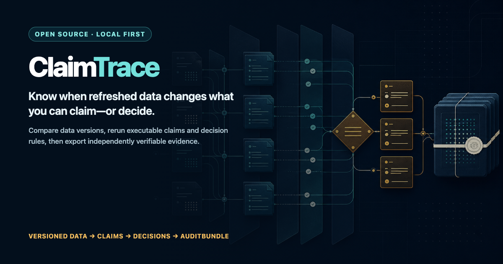
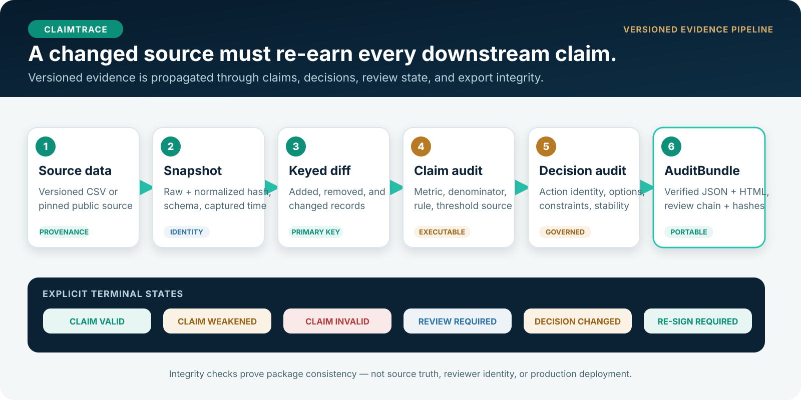
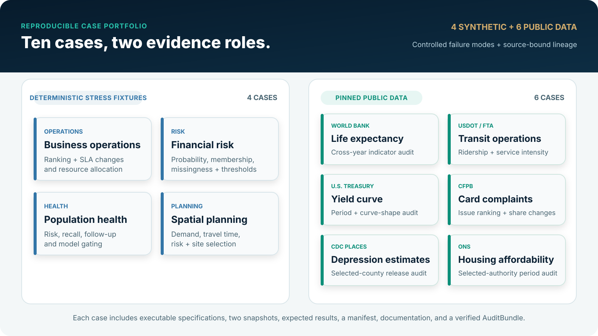
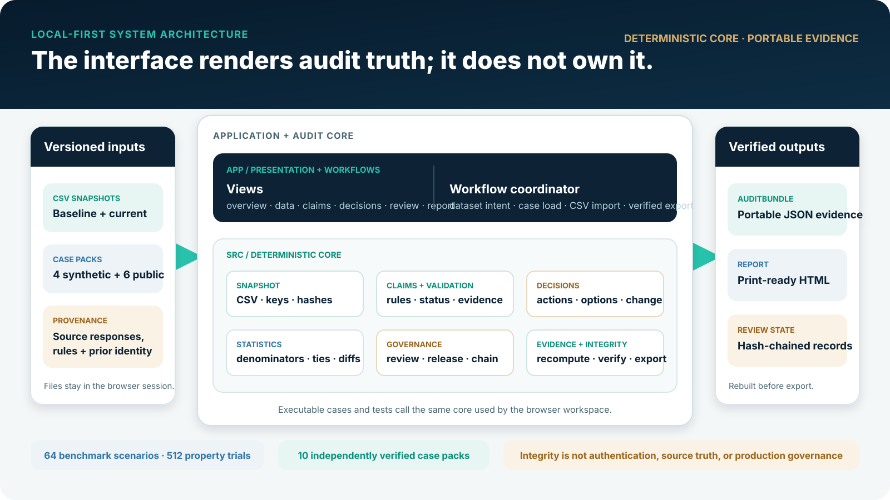

<p align="center">
  
</p>

<h1 align="center">ClaimTrace</h1>

<p align="center">
  <strong>Trace a changed dataset through the claims, decisions, and review records that depend on it.</strong>
</p>

<p align="center">
  <a href="https://github.com/limingrui679-design/ClaimTrace/actions/workflows/claimtrace-ci.yml"></a>
  <a href="https://github.com/limingrui679-design/ClaimTrace/actions/workflows/codeql.yml"></a>
  <a href="https://github.com/limingrui679-design/ClaimTrace/releases/latest"></a>
  <a href="LICENSE"></a>
  <a href="package.json"></a>
</p>

<p align="center">
  <a href="https://claimtrace-audit.limingrui2.chatgpt.site"><strong>Live read-only demo</strong></a>
  · <a href="#quick-start">Quick start</a>
  · <a href="docs/README.md">Documentation</a>
  · <a href="docs/CASE_CATALOG.md">Case catalog</a>
  · <a href="CONTRIBUTING.md">Contributing</a>
</p>

ClaimTrace is a local-first TypeScript and React prototype for versioned analytical-claim auditing. It binds natural-language conclusions to primary-key-aligned records, denominators, governed thresholds, exact evidence references, downstream decisions, and explicit local review state—then independently rebuilds the complete audit package before export.

<table>
  <tr>
    <td align="center"><strong>10</strong><br>reproducible cases</td>
    <td align="center"><strong>160 / 160</strong><br>automated checks</td>
    <td align="center"><strong>64 / 64</strong><br>benchmark scenarios</td>
    <td align="center"><strong>512</strong><br>property trials</td>
  </tr>
</table>

> **Project status:** the public site is a read-only portfolio build bound to release `v0.10.2` and visible receipt `92d741b`. The repository also runs as a local writable workspace. Neither mode claims authenticated sign-off, durable collaboration, institutional adoption, or production governance.

<details>
<summary><strong>Table of contents</strong></summary>

- [Why ClaimTrace](#why-claimtrace)
- [See it in action](#see-it-in-action)
- [Quick start](#quick-start)
- [Core capabilities](#core-capabilities)
- [Reproducible case portfolio](#reproducible-case-portfolio)
- [Architecture](#architecture)
- [Verification](#verification)
- [Trust boundary](#trust-boundary)
- [Documentation](#documentation)
- [Contributing](#contributing)

</details>

## Why ClaimTrace

Most diff tools answer **what changed in the data**. ClaimTrace continues the chain:

- Is the analytical claim still supported?
- Did the executable action change?
- If the action is unchanged, does refreshed evidence still require a new sign-off?
- Can another reviewer reconstruct the snapshots and rerun the result from the exported package?

<p align="center">
  
</p>

| Common failure | ClaimTrace control |
|---|---|
| Row order looks like record change | Versions align by a user-selected primary key. |
| A metric loses its sample and source | Evidence retains keys, physical lines, fields, denominators, and snapshot hashes. |
| A threshold appears authoritative without provenance | Value, unit, source, rationale, confirmer, and confirmation time are rule content. |
| Zero baselines, ties, or missing groups silently pass | Explicit edge states route unsupported comparisons to review. |
| Refreshed evidence inherits stale approval | Stable claim-result and decision identities invalidate old release state. |
| An export trusts its own stored answers | Verification reconstructs snapshots and reruns claims, decisions, lineage, reviews, and summaries. |

## See it in action

<p align="center">
  
</p>
<p align="center"><em>Real Chromium walkthrough of the compiled read-only reviewer path.</em></p>

The [public demo](https://claimtrace-audit.limingrui2.chatgpt.site) executes all ten committed cases without accepting data uploads or creating sign-off records. Run the repository locally to import CSV versions, define claims, record local review state, and generate verified exports.

## Quick start

Requires Node.js 22.13 or newer.

```bash
git clone https://github.com/limingrui679-design/ClaimTrace.git
cd ClaimTrace
npm ci
npm run dev
```

Open the local URL printed by Vite. For the first guided audit, see [Getting started](docs/GETTING_STARTED.md).

<details>
<summary><strong>CSV and export limits</strong></summary>

The local workspace accepts UTF-8 and BOM-marked UTF-8/UTF-16 CSV files, rejects malformed quote boundaries, and requires the same exact case-sensitive column set across versions. Each imported CSV is limited to 10 MiB before reading. Verified JSON and HTML export embed up to 500 KB of raw data per snapshot; larger files can be analyzed locally, but detached raw-file verification is not implemented.

</details>

## Core capabilities

| Layer | What is governed | Terminal evidence |
|---|---|---|
| Versioned snapshots | Encoding, strict CSV dialect, schema, primary key, raw and normalized SHA-256 | Added, removed, modified, and unchanged keyed records |
| Analytical claims | Formula, filters, denominator, threshold provenance, evidence scope | `SUPPORTED`, `WEAKENED`, `REVERSED`, `UNTESTABLE`, or `REVIEW_REQUIRED` |
| Decision impact | Action identity, feasible options, recommendation, assumptions, constraints, stability | `DECISION_CHANGED`, `RESIGN_REQUIRED`, or review state |
| Local review | Target result, disposition, note, previous-record hash, explicit assurance fields | Hash-chained but unauthenticated review record |
| Portable export | Snapshots, diffs, claims, decisions, lineage, reviews, summaries, canonical root | Independently verified AuditBundle JSON and matching HTML report |
| Cross-bundle history | Exact predecessor root | Verifiable `previousBundleHash` chain when prior bundles are retained |

See the [evidence model](docs/EVIDENCE_MODEL.md) for the complete object and identity contracts.

## Reproducible case portfolio

<p align="center">
  
</p>

| Deterministic stress fixtures | Provenance-bound public data |
|---|---|
| Business operations | World Bank life expectancy |
| Financial risk | USDOT transit operations |
| Population health with verified upstream lineage | U.S. Treasury yield curve |
| Spatial planning | CFPB complaints · CDC PLACES · ONS housing affordability |

Synthetic fixtures isolate controlled failure modes. Public-data cases retain pinned publisher responses, licenses, transformations, hashes, limitations, expected results, and verified bundles. They are descriptive demonstrations—not client projects, representative studies, causal evaluations, or evidence of real-world impact.

Open the [case catalog](docs/CASE_CATALOG.md) for primary keys, audit questions, artifact anatomy, and direct links to every case pack.

## Architecture

<p align="center">
  
</p>

| Directory | Responsibility |
|---|---|
| `app/` | React views and browser workflow orchestration |
| `src/core/` | Deterministic snapshots, statistics, claims, decisions, governance, integrity, and evidence export |
| `src/cases/` | Ten executable case specifications and shared runtime |
| `public/cases/` | Generated, self-contained case packs loaded by the browser |
| `benchmarks/` | Independent labels, controlled scenarios, and committed results |
| `tests/` | Unit, integration, property, built-artifact, and Chromium verification |
| `tools/` | Deterministic generators, source refresh, documentation check, benchmark, and release helpers |
| `docs/` | Guides, concepts, case catalog, evaluation, security, and release evidence |

The UI renders canonical core results; it does not own audit truth. Read the [architecture](docs/ARCHITECTURE.md) and [development guide](DEVELOPMENT.md) for module and workflow details.

## Verification

The committed `v0.10.2` verification record includes:

<table>
  <tr>
    <td align="center"><strong>155</strong><br>unit + integration</td>
    <td align="center"><strong>3</strong><br>build + release</td>
    <td align="center"><strong>2</strong><br>Chromium flows</td>
    <td align="center"><strong>10 / 10</strong><br>verified bundles</td>
  </tr>
  <tr>
    <td align="center"><strong>96.99%</strong><br>statements + lines</td>
    <td align="center"><strong>78.75%</strong><br>branches</td>
    <td align="center"><strong>99.37%</strong><br>functions</td>
    <td align="center"><strong>0</strong><br>known npm vulnerabilities</td>
  </tr>
</table>

Run the complete local gate:

```bash
npx playwright install chromium
npm run ci
npm audit --omit=dev
npm audit
```

The gate now includes local documentation-reference validation in addition to linting, type checking, deterministic generation, benchmarks, build checks, browser flows, and coverage. See [Evaluation](docs/EVALUATION.md) and [Release verification](docs/RELEASE_VERIFICATION.md) for the exact evidence and interpretation limits.

## Trust boundary

| Demonstrated by committed artifacts | Not demonstrated |
|---|---|
| Tamper-evident internal consistency | Authenticated reviewer identity |
| Deterministic claim and decision recomputation | Trusted timestamps or digital signatures |
| Local review-state propagation | Durable multi-user authorization or revocation |
| Public-data cleaning lineage | Publisher truth, institutional adoption, or domain validity |
| Reproducible prototype evaluation | Production deployment or real-user impact |

Review records explicitly declare `LOCAL_UNVERIFIED`, `LOCAL_CLOCK_UNVERIFIED`, `SELF_ASSERTED`, and `NONE` for identity, time, authorization, and cryptographic signature. Read [Security](docs/SECURITY.md), [Limitations](docs/LIMITATIONS.md), and the proposal-only [Roadmap](docs/ROADMAP.md) before extending these claims.

## Documentation

| Need | Entry point |
|---|---|
| Run a first audit | [Getting started](docs/GETTING_STARTED.md) |
| Browse all cases | [Case catalog](docs/CASE_CATALOG.md) |
| Understand objects and identities | [Evidence model](docs/EVIDENCE_MODEL.md) |
| Inspect modules and data flow | [Architecture](docs/ARCHITECTURE.md) |
| Reproduce quality evidence | [Evaluation](docs/EVALUATION.md) · [Release verification](docs/RELEASE_VERIFICATION.md) |
| Review security and non-goals | [Security](docs/SECURITY.md) · [Limitations](docs/LIMITATIONS.md) |
| Develop or contribute | [Development](DEVELOPMENT.md) · [Contributing](CONTRIBUTING.md) |
| Navigate everything | [Documentation hub](docs/README.md) |

## Contributing

Focused bug reports, evidence-model proposals, accessibility improvements, documentation fixes, and bounded reproducible cases are welcome. Read [CONTRIBUTING.md](CONTRIBUTING.md), follow the [Code of Conduct](CODE_OF_CONDUCT.md), and run `npm run ci` before opening a pull request. Security issues should follow the private-reporting guidance in [docs/SECURITY.md](docs/SECURITY.md).

## Citation

Software citation metadata is available in [CITATION.cff](CITATION.cff).

## License

[MIT](LICENSE) © 2026 Mingrui Li
