# Architecture

ClaimTrace is one repository with explicit module boundaries. The UI never owns audit truth; it renders canonical objects produced by the deterministic core.

```mermaid
flowchart LR
    U["Upstream records or pinned public API responses"] --> A["Verified cleaning / reproducible aggregation"]
    A --> S["Summary snapshot verification"]
    B["Baseline / revision CSV"] --> S
    S --> K["Unique-key alignment"]
    K --> P["Sample and missingness profile"]
    P --> C["ClaimSpec execution"]
    C --> D["Signed-history decision comparison"]
    D --> O["Option scoring and constraints"]
    O --> G["Human review and release state"]
    C --> E["Canonical AuditBundle"]
    G --> E
    E --> V["Independent reconstruction and recomputation"]
    E --> H["Verified HTML handoff"]
    E --> X["previousBundleHash chain"]
    X --> V
```

## Module boundaries

- `src/core/snapshot`: decoding, strict versioned CSV parsing, exact physical lines, baseline-ordered canonical rows, raw and normalized SHA-256, primary-key validation, and snapshot manifests.
- `src/core/claim-spec`: independent support/reversal threshold provenance and confirmation checks.
- `src/core/statistics`: filtering, aggregation, effective denominators, missingness, sample-composition fingerprints, keyed row diffs, and tie-aware rankings.
- `src/core/validation`: snapshot/comparison claim status computation, balanced two-sided source-reference extraction, boundary sampling, canonical content-derived result identities, and imported diagnostic claims.
- `src/core/decision`: current claim gating, active action-identity comparison, numerical-input provenance gates, comparison with stored signed decision history, deterministic multi-option scoring, constraint filtering, break-even values, score intervals, Pareto frontiers, stability sweeps, and fixed-seed bounded Monte Carlo.
- `src/core/governance`: UUID/SHA-256-chained append-only review objects, explicit local-unverified assurance fields, and separate engine/disposition/release state transitions.
- `src/core/integrity`: canonical JSON, portable SHA-256, stable review-result hashes, semantic action/policy hashes, and decision-input provenance hashes.
- `src/core/evidence`: computed completeness, bounded AuditBundle export, independent snapshot/claim/decision/review/upstream/public-source verification, cross-bundle-chain verification, and standalone HTML reports.
- `src/cases`: ten executable case specifications and shared browser/test runtime. Six are pinned official public-data transformations covering operations, fixed income, consumer finance, population health, planning, and international indicators; four are deterministic synthetic stress fixtures for controlled failure modes. Self-contained generated packs live under `public/cases`.
- `benchmarks`: 64 independently labeled scenarios across eight edge-case families, multiple baselines, ablations, and committed results. Deterministic property tests live under `tests/property.test.ts`.

`app/claimtrace-core.ts` is a compatibility re-export only. New core logic belongs in `src/core`.

## Determinism boundary

CSV decoding, keyed alignment, upstream aggregation, status assignment, decision propagation, completeness, and AuditBundle verification are deterministic. A future LLM may propose a draft claim or mapping, but it must not assign the final status or bypass the same deterministic validator.

The application shell is a stable Vite + React SPA. Case loading, whole-project import, revision import, and demo restoration share one monotonic dataset-intent generation. A newer intent aborts pending case fetches, invalidates unfinished file reads, and prevents stale audit, review, or export work from mutating or downloading results for a replacement dataset. Review and export activation is also serialized so repeated activation cannot fork a review chain or duplicate one export operation. The public build can set `VITE_PUBLIC_READ_ONLY=true`, which omits import, claim-creation, review, and sign-off controls and dialogs from the rendered interface while preserving navigation, case execution, evidence inspection, and downloads. Separate real-browser suites verify the public read-only mode and the full writable workflow. There is no application upload endpoint.

## Scale boundary

The browser prototype rejects local CSV files above 10 MiB before reading, and exports at most 500 changed-record entries, 200 source references per claim, 20 preview rows per snapshot, and 500 KB of raw text per embedded snapshot. Snapshots above 500 KB remain available for local analysis, but verified AuditBundle and HTML report export is blocked because detached raw-file verification is not implemented. At the reference boundary, baseline/current quotas, paired changes, rule-specific boundary records, and fixed-seed samples are recorded explicitly. Full-snapshot statistics used to rank those references are precomputed once per snapshot instead of once per row. This is an explicit prototype boundary, not a warehouse-scale claim or latency guarantee.
